# unitool

## 背景介绍

### 前端工程化诉求

在以前，前端的开发工作在一些场景下被认为只是日常的一项简单工作，或只是某个项目的"附属品"，并没有被当做一个"软件"而认真对待。但随着前端业务日益复杂化和多元化，前端开发已经由以“网页”模式为主转变为以“应用”模式为主了。现在随便找个前端项目，都已经不是过去的拼个页面加和搞几个 jQuery 插件就能完成的了。工程复杂了就会产生许多问题，比如：如何进行高效的多人协作？如何保证项目的可维护性？如何提高项目的开发质量？...

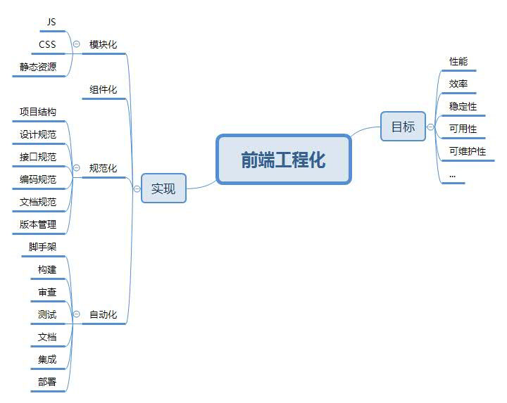

参考文献

- [谁能介绍下web前端工程化？](https://www.zhihu.com/question/24558375/answer/139920107)
- [京东前端工业化实践之路](https://github.com/d2forum/9th/blob/master/PPT/%E4%BA%AC%E4%B8%9C%E5%89%8D%E7%AB%AF%E5%B7%A5%E4%B8%9A%E5%8C%96%E5%AE%9E%E8%B7%B5%E4%B9%8B%E8%B7%AF--%E5%88%98%E5%A8%81.pdf)

### 前端生态的野蛮成长

近十年来，随着前端业务变得日益复杂，NodeJS 逐渐崛起，前端本地开发工具如雨后春笋般涌现，前端开发生态也日渐完善。

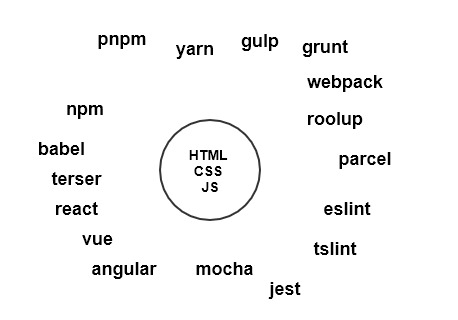

- 运行环境：V8、Node、Deno
- 包管理器：npm、yarn、bower、pnpm、tink
- 脚手架：Vue CLI、Angular CLI、Create React APP、Yeoman
- 编译器：Babel、Closure Compiler、Prepack、haxe
- 测试工具：Mocha、Jasmine、Jest、Karma
- 构建工具：esbuild
- 调试工具： Chrome DevTools、Firebug、Webkit inspector、VS Code
- 代码格式化：JSLint、JSHint、ESLint、TSLint
- 任务管理工具：grunt、gulp
- 构建工具：webpack、rollup、parcel、browserify、esbuild
- 进程管理：nodemon、pm2、forever
- 前端框架：Angular、React、Vue、React Native、jQuery
- 后端框架：Express、Koa、Nestjs
- ...

但是，对于学习 JavaScript 的新人来说：工具太多了，挑花了眼。不管你要做什么，几乎都要面临各种各样的选择。

在知乎上，基本上每隔一段时间就要争论一番：React 和 Vue 谁更好！

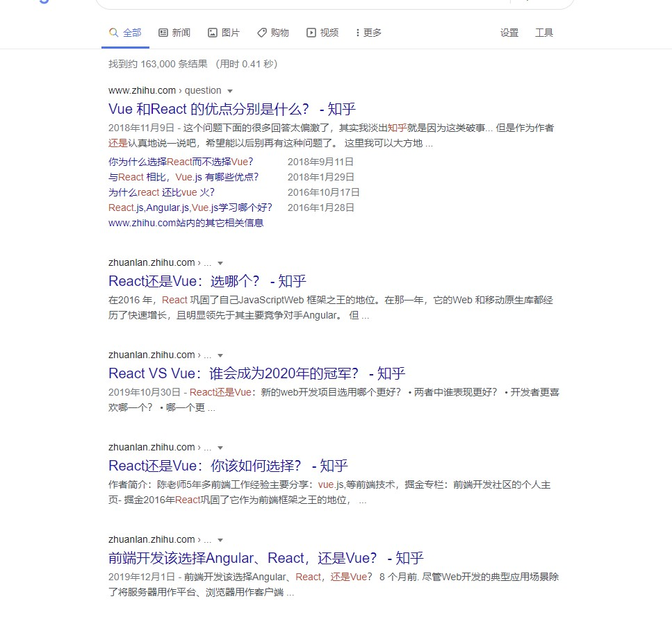

前端的构建工具也是一大把，几乎每年都有新的构建工具诞生，类似下面这样的疑问普遍存在新人的学习过程中。

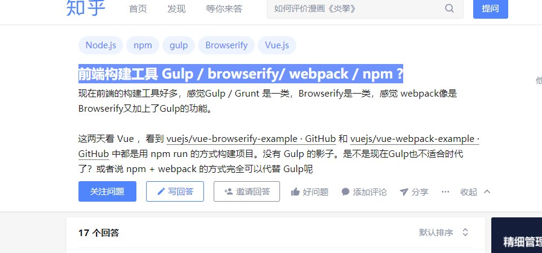

虽然这两年已经逐渐被 webpack 一统天下，但是还是有同类的工具不断的冒出来，比如：Esbuild、Snowpack。

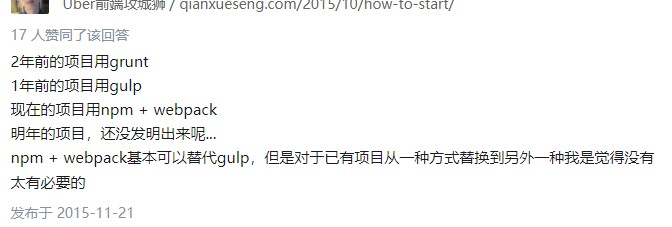

前端生态的野蛮生长和社区的各种激烈争论，让前端“荣获”娱乐圈的称号。而过快的技术更新迭，也导致前端开发人员对学习新技术感到疲倦和恐惧。当你在网络上学习和查找资料时，很多中文博文很可能已经过时了，对于不熟悉英文无法阅读官网文档一手资料的开发人员来说，问题更为严重。在前年(2018)，Deno 刚推出的时候，甚至有人在 Deno 的 Github Issue 里情绪化的吐槽：

> “求不要更新了，老子学不动了！”

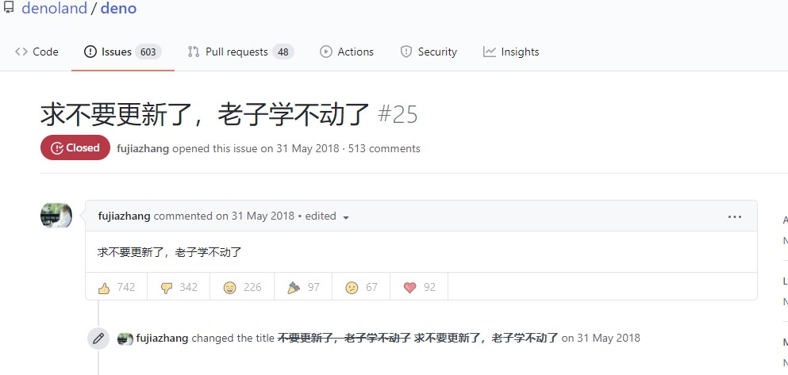

参考文献

- [前端构建工具 Gulp / browserify/ webpack / npm ?](https://www.zhihu.com/question/37694275)
- [求不要更新了，老子学不动了](https://github.com/denoland/deno/issues/25)
- [老子学不动了！](https://zhuanlan.zhihu.com/p/40980806)
- [开篇词——技术更新的太快，真的快学不动了](https://xiaozhuanlan.com/topic/2457308916)
- [如何看待deno项目github源码issue栏目出现“求不要更新了，老子学不动了？”？](https://www.zhihu.com/question/279356207)

### 分析与总结

1. 缺乏统一的工程化最佳实践

    **成熟的软件项目必然有遵循良好的开发规范，也拥有属于自身独特的软件开发生命周期。**
    
    但是每个人对前端工程化的认识不同，而这取决于个人的开发工作经验和业务背景。有经验的开发人员可能会选择从零开始搭建一套项目开发框架，其他有些会选择从 Github 下载别人分享的项目开发模板，或者直接从 hello world 开始勉强的把代码写下去。一个项目的工程化实践情况，很大程度上受限于开发人员的技术水平。

    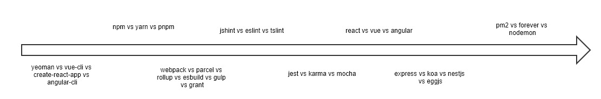

    如上图所示是一个前端项目开发工作流涉及到的技术面和需要做选型的大致情况（脚手架、依赖管理、构建工具、代码审查和自动化测试等）。能够要从左到右要做到面面俱到的开发人员是非常少的，你不仅仅有要知道完整开发工作流各个环节的存在和必要性，还要知道各个环节可以采纳技术的优缺点和使用场景。

    ps：其实近几年来，各个前端开发框架都逐渐维护和完善了自己的命令行工具和项目脚手架，React 有 create-react-app、Vue 由 vue-cli、Angular 有 ng-cli，这些默认配置好的最佳实践方案已经大大改善了这一现状。但是每个公司都存在特殊业务场景，官方的工具可能无法满足特殊的业务需求，而像 create-react-app 这种没有提供定制化配置选项的工具常常给开发人员带来困扰，Google 和 Stack Overflow 上也时长有认会问“create-react-app 支不支持这个，支不支持那个？”。vue-cli 相对于 create-react-app 提供了更开放的插件机制，可以满足多大业务场景的诉求，但是也带来了新的学习成本。而且社区也大量存在着类似像 vue-cli 这样的工具，例如：为 react 定制的 umi，也有自己的一套插件系统。而且，基本各个公司富有”创造力“的前端开发人员都会开发自己的轮子。

2. 技术选型碎片化

    

    由于缺乏统一的工程化最佳实践，新项目技术选型时往往受主导项目的开发人员主观影响，很多人提到技术选型时都有提到自己偏好某项技术，或者最近想尝试某项新技术，从而完善自己的工作履历。
    
    即使公司规定的技术栈可能是统一的，但项目工程环节较多，可选型技术五花八门。当团队负责的工程数量达到一定的规时，选型的碎片化无疑会让维护成本陡增。

3. 研发环节缺乏量化评估

    前端领域的语言标准、开发框架和工具链已逐渐成熟，研发提效成为了团队的重要目标之一 —— 回归编码本身，量化评估工程质量。但是目前我们在寻找可以项目质量量化的研发指标时，只有测试部门提供的 Bug 率和运维部门提供的服务稳定行，而对研发环节缺乏有效的量化评估手段。比如，当我们在团队中将“提升代码的可维护性”，我们到底在讲什么呢？也许每个人都有自己的理解。 基于以上问题，我们需要建立一个前端工程质量评估模型，以便能够清楚地了解每一个工程哪里做得好？好到什么程度？哪里做得不够好？应该如何改进？

    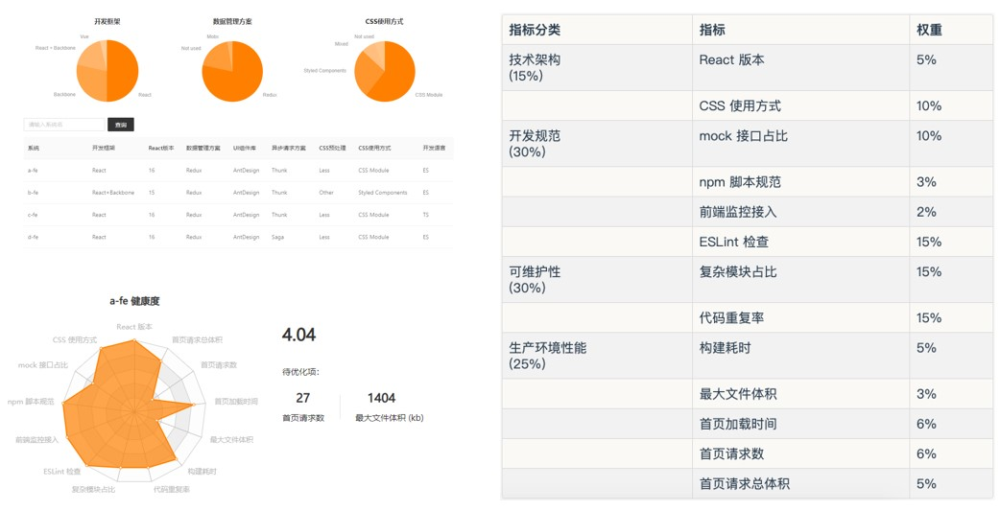

    具体参考博文[《如何衡量前端工程质量？我们有了平台化的解决方案》](https://mp.weixin.qq.com/s?__biz=MzUxMzcxMzE5Ng==&mid=2247499390&idx=1&sn=476adc7dabb363742cbf85002e1afda7)。

## 目标

实现统一的前端开发工具，并维护相应的文档和社区。

该开发工具应符合以下特性：

1. 最佳实践：提供各个框架的最佳工程化实践方案，开发人员只要关心业务实现，并按照开发工具提供的开发工作流去实践即可。
2. 规范技术选型：每个组织有自己的技术栈倾向，可支持定制化的项目初始化流程，以满足不同组织的需要。
4. 量化评估工程质量：通过代码审查和测试工具等实现统一的工程质量量化，且能够自动生成报告文档。

## 行动

### 后端语言是怎么做的？

本文主要以 Java 作为参照，分析后端语言的项目管理工具使用情况。

题外话：谈谈 JavaScript 和 Java 之间的关系？JavaSript 不是 Java 的脚本语言，但在诞生之初却与 Java 存在密切的联系。JavaScript 语言最初是网景公司设计的，当时整个管理层，都是 Java 语言的信徒，设计 JavaScript 时，就是奔着简化版 Java 语言去的。

ant =》maven =》gradle

- ant：类似前端的 gulp，用来跑任务，不支持依赖管理
- maven：一个支持依赖管理的项目管理工具，可以用来构建项目、生成文档、创建报告、部署和发布等
- gradle：在 maven 基础之上，采用 groovy 为配置语言，解决 maven 配置繁琐和不够灵活的问题。

虽然 Maven 相对比 Gradle 不够灵活，但是这反过来也是 maven 的优势。Maven 严格规范了项目开发的生命周期，每个生命周期有多个阶段组成，每个阶段绑定了不同的 Maven 插件的执行目标。

1. clean：清除项目构建产物

    > pre-clean => clean => post-clean

2. default：默认声明周期，也是主要的生命周期，用于构建应用

    > validate => compile => test => package => verify => install => deploy

3. site：生成报告文档、部署站点

    > pre-stie => site => post-site => site-deploy

总结：Java 语言有统一的项目管理工具 Maven，不像前端那样使用的技术五花八门，Maven 规范了项目的开发工作流。

参考文献

[构建工具的进化：ant, maven, gradle](https://zhuanlan.zhihu.com/p/24429133)

### 现有“解决”方案

- [rome](https://romefrontend.dev/)

    Rome 由就职于 Facebook 同时是 Babel 和 Yarn 作者的 Sebastian McKenzie 主导开源。目前，Rome 还只是一个实验性的 JavaScript 工具链，其包括编译器、lint、格式化程序、捆绑器、测试框架等，旨在替代许多现有的 JavaScript 工具，成为与 JavaScript 源码处理相关的所有功能的综合工具（Rome 不是现有工具的集合，所有组件都是自定义的，不使用第三方依赖项。

    但是，目前 Rome 还处于早期开发阶段，目前只支持 lint，还不够成熟。

    参考文献
        
    - [欲取代绝大多 JavaScript 工具链？Rome 尝鲜](https://zhuanlan.zhihu.com/p/128638932)
    - [Rome, a new JavaScript Toolchain](https://jasonformat.com/rome-javascript-toolchain/)
    - [如何评价 Facebook 推出的前端工具链 Rome？](https://www.zhihu.com/question/375769627)

- [neutrinojs](https://neutrinojs.org/usage/)

    Neutrino 是基于 Webpack 实现的配置管理工具，支持基于共享的配置预设和中间件来构建、测试、审查和开发 JavaScript 项目。并且可以在项目中与 Webpack，ESLint，Jest，Karma 等 CLI 工具一起使用。

    Neutrino 是一个前端统一工具的一个很好的实践案例，它在现有工具链的基础上实现，而不是重新从零开始。但是 Neutrino 局限于 webpack，而目前 JavaScript 适用性越来越广，不仅用于 H5，还存在着类似 React Native、小程序等这样的框架。此外，Neutrinojs 虽然已经实现好了中间件和预设机制，但是项目管理脚本还是需要使用底层工具提供的 CLI，对于新手还是需要去学习各个工具的配置和 CLI 用法。

### 自研“统一前端开发工具”

为了能够让前端的开发工作流更加规范化，我们可以借鉴 maven 和 gradle 的设计思想来实现统一的前端开发工具。它应该由生命周期、阶段和插件的概念。除此之外借鉴前端开发工具的一些设计思想，引入了预设和组织的概念。

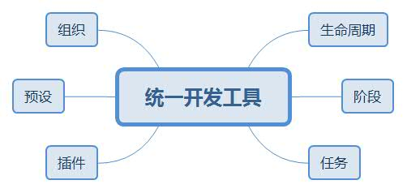

#### 生命周期

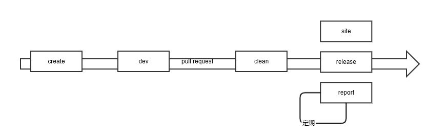

生命周期规范了项目的开发工作流，目前有五个生命周期，他们相互独立。

- create：创建新项目
- dev：启动开发调试服务
- release：构建发布项目
- site：生成项目站点
- report：生成项目质量报告
- clean：清理

每个生命周期都可以作为命令执行，例如：`unitool clean release site` 这个命令会先清空输出目录，然后发布，最后生成站点。

#### 阶段

每个生命周期包含一些阶段，这些阶段时有顺序的，并且后面的阶段依赖于前面的阶段。

- create

    1. validate：验证环境
    2. initiate：初始化
    3. prompt：命令行交互
    4. config：配置项目
    5. default：默认操作
    6. generate：输出项目文件
    7. confilct：处理冲突
    8. install：安装依赖
    9. end：结束

- dev

    1. validate：验证配置
    2. config：开发配置
    3. initiate：初始化
    4. start：启动调试服务

- release

    1. validate：校验，可以做配置检查、依赖检查、代码审查和单元测试
    2. config：发布配置
    3. initiate：初始化
    4. build：构建
    5. package：打包
    6. install：安装
    7. deploy：部署

- audit

    1. lint
    2. test
    3. score
    4. generate

- site

    1. validate：校验
    2. initiate：初始化
    3. prompt：命令行交互
    4. generate：生成文档
    5. deploy：部署文档

- clean

    1. pre-clean
    2. clean
    2. post-clean

默认会执行生命周期的每个阶段，但也可以指定执行某个阶段，例如：`unitool relese:build` 这个命令会执行 release 的生命周期至 release 阶段。

#### 任务

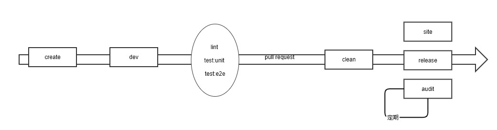

任务是对生命周期的扩展，它可以独立于生命周期运行，而且也可以绑定到特定的生命周期的某个阶段中，例如：lint（代码审查）可以绑定到 release 的 validate 阶段。默认约定了以下任务：

- lint：代码审查，默认会绑定到 validate 阶段
- test:unit：单元测试，默认会绑定到 validate 阶段
- test:e2e：端到端测试，默认会绑定到 validate 阶段
- doctor：校验环境，默认会绑定大 validate 阶段

类似生命周期，可以直接在命令行中调用指定的任务，例如：`unitool lint` 会审查代码，`unitool lint --fix` 会自动格式化代码。

#### 插件

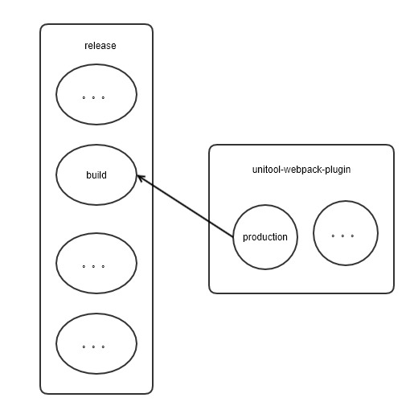

生命周期的每个阶段的任务都是由插件来完成的，对于插件本身来说，为了能够复用代码，它往往能够完成多个任务。例如：unitool-plugin-npm，它能够基于项目依赖做很多事情，它能够在 create:install 中安装依赖，它能够在 release:validate 中分析项目依赖，帮助找出潜在的无用依赖，它能够列出项目的依赖树，帮助分析依赖来源。 

#### 预设

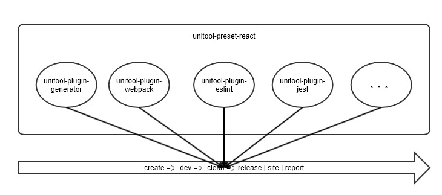

一个开发框架的工程化最佳实践需要使用到大量的插件来完成任务，如果每个项目的配置文件都需要配置一堆插件，对于新手来说无疑是一个很大的跳转。所以，这里借鉴了 babel 的配置方案，引入了预设的概念（preset）。每个预设都由一系列的插件组成，例如：`unitool-preset-react` 可能由 `unitool-plugin-webpack`、`unitool-plugin-npm`、`unitool-plugin-eslint`、`unitool-plugin-jest` 等组成，该预设已经为你做好了 react 工程化开发最佳实践配置。此外，每个预设都预留了可扩展的配置，以满足不同业务场景的个性化需求。

#### 组织

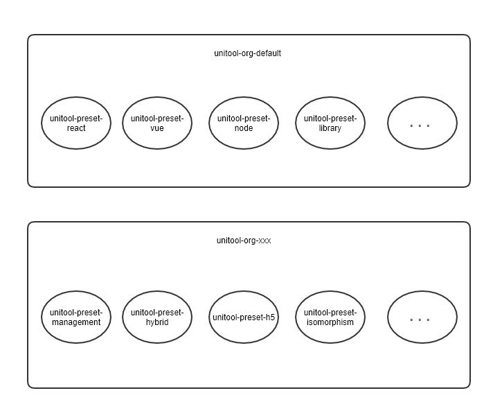

一个组织对应一个公司或者一个开发团队，每个组织都应该统一的技术栈和规范的技术选型，并且它们的项目生命周期每个阶段的处理过程可能都会不一样。针对这些差异会的需求，每个会有自己扩展的插件、预设，而组织就是用于管理这些插件和预设的载体，通过组织的形式可以统一项目的技术选型和生命周期。例如：一个团队偏向于 react 开发框架，那么项目创建时可以约定 create 生命周期的命令行交互环节的技术选型范围，PC 后台、移动端混合 H5 应用都默认会采用 React 技术栈的模板。

#### 总结

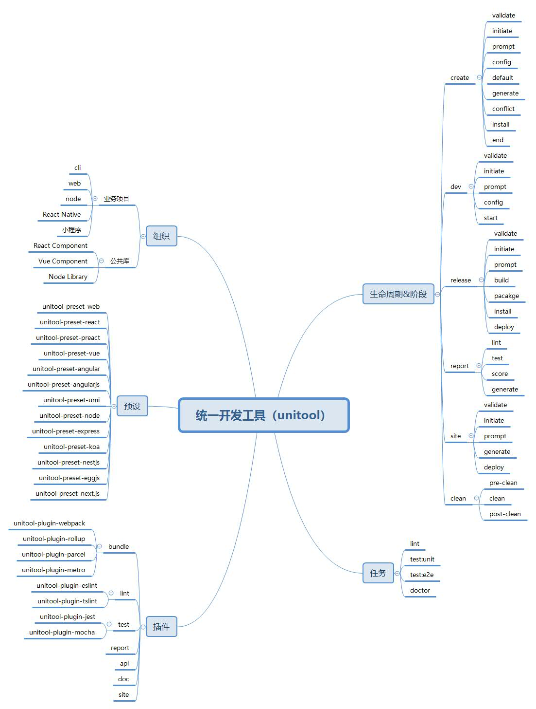

## 计划

1. 前端工具链学习兴趣小组；
2. 逐步实现统一完善的前端开发工具；
3. 完成现有项目的开发工具重构；
4. 推广与开源。
